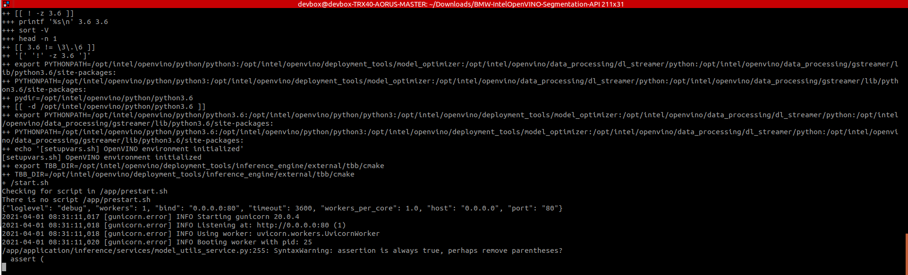
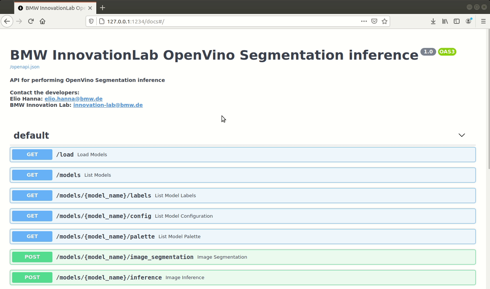
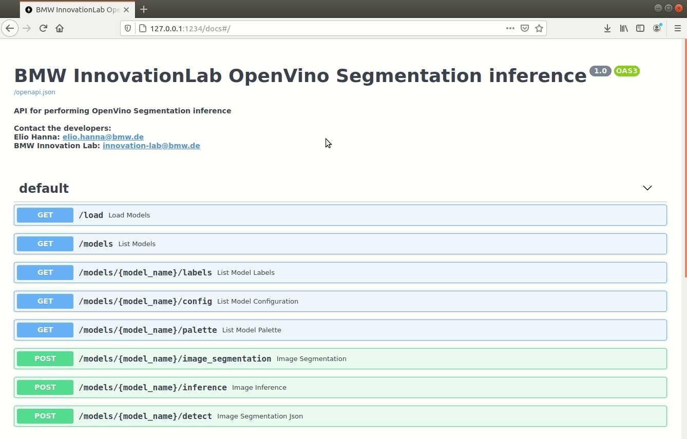
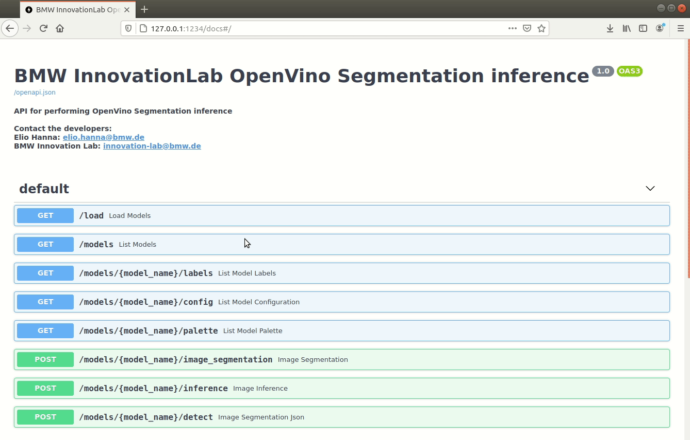
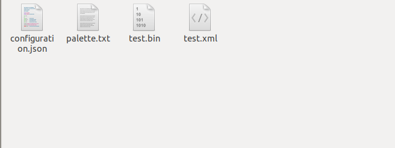

# BMW-IntelOpenVINO-Segmentation-Inference-API

This is a repository for a semantic segmentation inference API using the OpenVINO toolkit. It's supported on both Windows and Linux Operating systems.

Models in Intermediate Representation(IR) format, converted via the [Intel&reg; OpenVINO&trade; toolkit v2021.1](https://docs.openvinotoolkit.org/latest/index.html), can be deployed in this API. Currently, OpenVINO supports conversion for DL-based models trained via several Machine Learning frameworks including Caffe, Tensorflow etc. Please refer to [the OpenVINO documentation](https://docs.openvinotoolkit.org/2021.1/openvino_docs_MO_DG_prepare_model_convert_model_Converting_Model.html) for further details on converting your Model.

**Note: To be able to use the sample inference model provided with this repository make sure to use** `git clone` **and avoid downloading the repository as ZIP because it will not download the acutual model stored on** `git lfs` **but just the pointer instead**


## Prerequisites

- OS:
  - Ubuntu 18.04
  - Windows 10 pro/enterprise
- Docker

### Check for prerequisites

To check if you have docker-ce installed:

```sh
docker --version
```

### Install prerequisites

#### Ubuntu

Use the following command to install docker on Ubuntu:

```sh
chmod +x install_prerequisites.sh && source install_prerequisites.sh
```

#### Windows 10

To [install Docker on Windows](https://docs.docker.com/docker-for-windows/install/), please follow the link.


## Build The Docker Image

In order to build the project run the following command from the project's root directory:

```sh
docker build -t openvino_segmentation -f docker/Dockerfile .
```
### Behind a proxy

```sh
docker build --build-arg http_proxy='' --build-arg https_proxy='' -t openvino_segmentation -f docker/Dockerfile .
```

## Run The Docker Container

If you wish to deploy this API using **docker**, please issue the following run command.

To run the API, go the to the API's directory and run the following:

#### Using Linux based docker:

```sh
docker run -itv $(pwd)/models:/models -v $(pwd)/models_hash:/models_hash -p <port_of_your_choice>:80 openvino_segmentation
```
#### Using Windows based docker:
&NewLine;
##### Using PowerShell:
```sh
docker run -itv ${PWD}/models:/models -v ${PWD}/models_hash:/models_hash -p <port_of_your_choice>:80 openvino_segmentation
```
##### Using CMD:
```sh
docker run -itv %cd%/models:/models -v %cd%/models_hash:/models_hash -p <port_of_your_choice>:80 openvino_segmentation
```
The <docker_host_port>  can be any unique port of your choice.

The API file will run automatically, and the service will listen to http requests on the chosen port.


## API Endpoints

To see all available endpoints, open your favorite browser and navigate to:

```
http://<machine_IP>:<docker_host_port>/docs
```

### Endpoints summary

#### /load (GET)

Loads all available models and returns every model with it's hashed value. Loaded models are stored and aren't loaded again.



#### /models/{model_name}/detect (POST)

Performs inference on an image using the specified model and returns the bounding-boxes of the class in a JSON format.



#### /models/{model_name}/image_segmentation (POST)

Performs inference on an image using the specified model, draws segmentation and the class on the image, and returns the resulting image as response.




## Model structure

The folder "models" contains subfolders of all the models to be loaded.
Inside each subfolder there should be a:

- bin file (<your_converted_model>.bin): contains the model weights

- xml file (<your_converted_model>.xml): describes the network topology

- configuration.json (This is a json file containing information about the model)

  ```json
    {
      "classes":4,
      "type":"segmentation",
      "classesname":[
        "background",
        "person",
        "bicycle",
        "car"
      ]
    }
  ```

## How to add new model 

### Add New Model and create the palette
create a new folder and add the model files ('.bin' and '.xml' and the 'configuration.json')
after adding this folder run the following script

```
python generate_random_palette.py -m <ModelName>
```
this script will generate a random palette and add it to your files

The "models" folder structure should now be similar to as shown below:

```shell
│──models
  │──model_1
  │  │──<model_1>.bin
  │  │──<model_1>.xml
  │  │──configuration.json
  |  |__palette.txt
  │
  │──model_2
  │  │──<model_2>.bin
  │  │──<model_2>.xml
  │  │──configuration.json
  │  │──palette.txt
```
&NewLine;
&NewLine;

## Acknowledgements

[OpenVINO Toolkit](https://github.com/openvinotoolkit)

[intel.com](https://intel.com)

[Elio Hanna](https://github.com/Elio-hanna)
